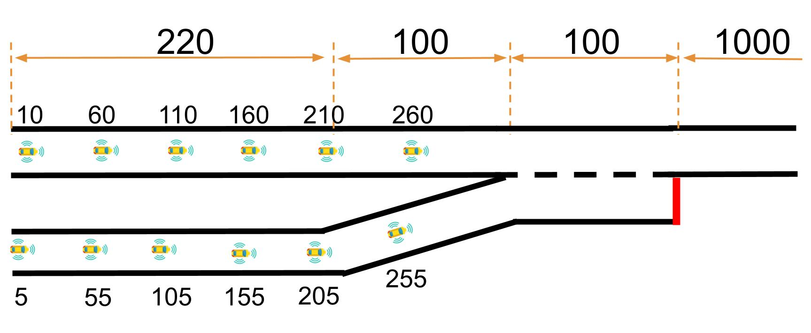

# Safe CAV lane changes using Multi-agent Reinforcement Learning and Control Barrier Functions

An on-policy MARL algorithm for highway on-ramp merging problems integrated with safety shileds HSS and MASS designed using Control Barrier Functions (CBFs).

     
      Fig.1 Illustration of the considered on-ramp merging with possible initial positions of CAVs.

## Installation
- Create an python virtual environment: `conda create -n marl_cav python=3.6 -y`
- Activate the virtual environment: `conda activate marl_cav`
- Install pytorch (torch>=1.2.0): `pip install torch===1.7.0 torchvision===0.8.1 torchaudio===0.7.0 -f https://download.pytorch.org/whl/torch_stable.html`
- Install the requirements: `pip install -r requirements.txt`

## Unsafe MARL

### Training

`python run_mappo.py --config configs/configs_marl-cav-unsafe.ini`

<!-- ### Training curves

     
      Fig.2 Performance comparison between the proposed method and 3 state-of-the-art MARL algorithms.

 -->

### Evaluation

`python run_mappo.py --option eval --model-dir results/Mmm_DD_HH_MM_SS`

## Hybrid Safety Shield (HSS)

     
      Fig.2 Architecture of MARL-HSS.

 

### Training
`python run_mappo.py --config configs/marl_cav-heading-t_headway-cbf-avs_cint.ini`
<!-- ### Training curves

     
      Fig.2 Performance comparison between the proposed method and 3 state-of-the-art MARL algorithms.

 -->

### Evaluation
`python run_mappo.py --option eval --model-dir results/Mmm_DD_HH_MM_SS`

## Multi-Agent Safety Shield (MASS)

     
      Fig.2 Architecture of MARL-MASS.

 

### Training
`python run_mappo.py --config configs/marl_cav-heading-t_headway-cbf-cav.ini`
<!-- ### Training curves

     
      Fig.2 Performance comparison between the proposed method and 3 state-of-the-art MARL algorithms.

 -->

### Evaluation
`python run_mappo.py --option eval --model-dir results/Mmm_DD_HH_MM_SS`

## Multi-Agent Safety Shield (MASS) with a reward designed for MARL trained with MASS safety shield.

### Training
`python run_mappo.py --config configs/marl_cav-heading-t_headway-cbf-cav-td3-srew.ini`
<!-- ### Training curves

     
      Fig.2 Performance comparison between the proposed method and 3 state-of-the-art MARL algorithms.

 -->

### Evaluation
`python run_mappo.py --option eval --model-dir results/Mmm_DD_HH_MM_SS`

## Additional commands

- To test the MARL-**** with small number of episodes
     `python run_mappo.py --config configs/configs_marl-cav-test.ini`

## Reference
- [Highway-env](https://github.com/eleurent/highway-env)
- [MARL-CAV](https://github.com/DongChen06/MARL_CAVs)
- [RL-CBF](https://github.com/rcheng805/RL-CBF)
